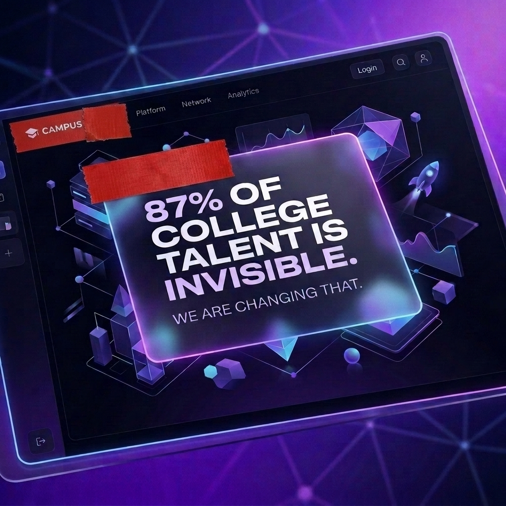
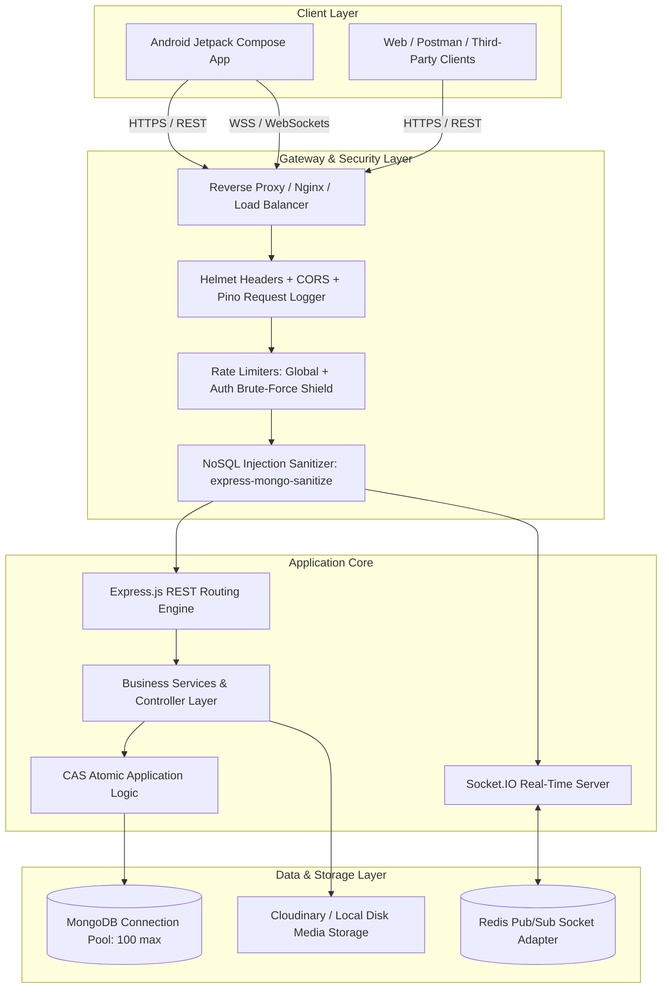
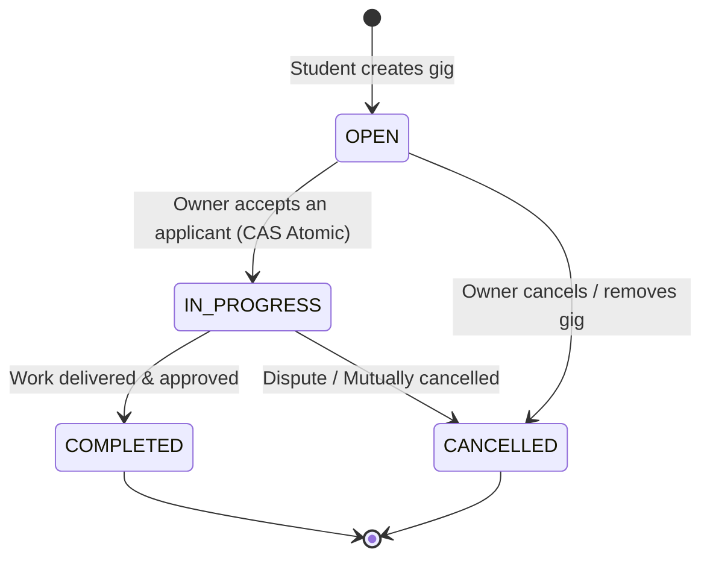
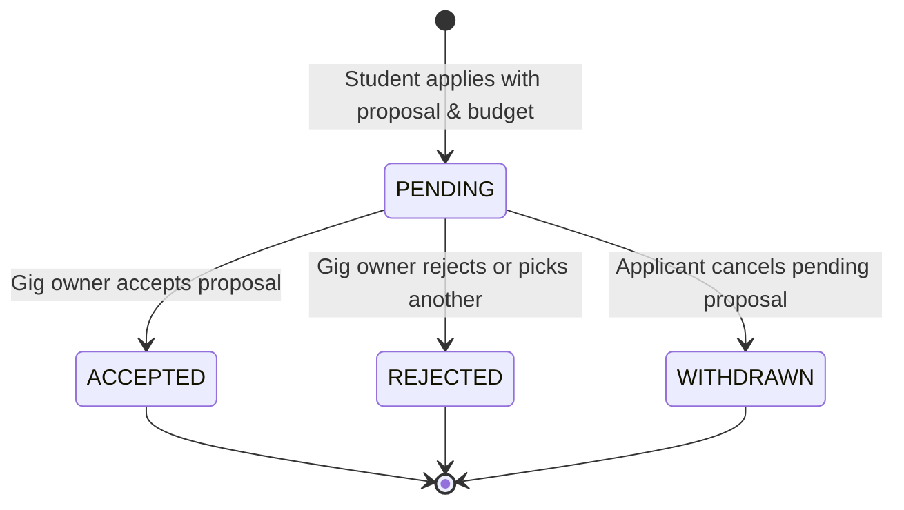
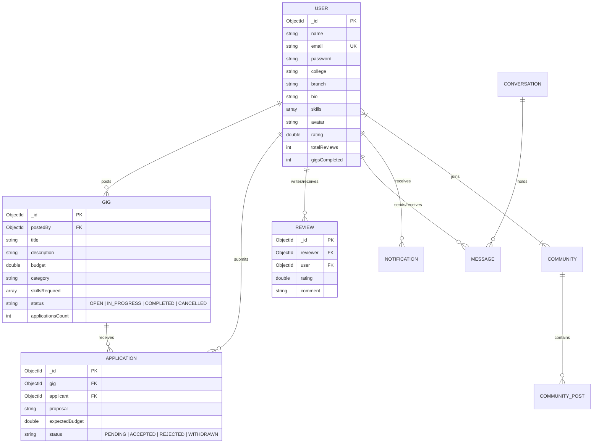

# 🎓 CampusGig — Backend API & Real-Time Engine

<p align="center">
  
</p>

[](https://nodejs.org/)
[](https://expressjs.com/)
[](https://www.mongodb.com/)
[](https://socket.io/)
[](https://redis.io/)
[](https://jestjs.io/)
[](https://github.com/not-a-hack-er/campus_gig-backend)
[](https://opensource.org/licenses/MIT)

---

## 📖 Project Overview

**CampusGig** is an end-to-end peer-to-peer freelancing and micro-gig marketplace designed specifically for college campuses. It bridges the gap between students seeking help with technical, creative, or academic projects and talented campus peers ready to freelance, earn, and build real-world portfolios.

This repository contains the **production-ready Backend API and Real-Time WebSocket Engine**, engineered with high scalability, fault tolerance, robust security, and seamless integration with the **CampusGig Android mobile app**.

---

## 💡 The Problem & The Solution

| The Campus Problem | CampusGig Solution |
|---|---|
| **Fragmented Communication**: Gigs and side-projects are scattered across unorganized WhatsApp/Telegram groups with zero accountability. | **Centralized Marketplace**: Filterable listings categorized by tech stack, design, video editing, writing, and custom campus needs. |
| **Payment & Trust Hesitation**: Students fear scams, ghosting, or poor deliverables from anonymous contacts. | **Reputation Engine & Verified Profiles**: Peer reviews, 1–5 star ratings, badges, and completed gig counters tied to student college profiles. |
| **Race Conditions in Hiring**: Multiple applicants being promised the same task without atomic synchronization. | **Compare-And-Swap (CAS) Concurrency**: Atomic gig claim validation preventing double-acceptance conflicts. |
| **Laggy Chat & Missed Updates**: Delayed message delivery across disparate platforms. | **Real-Time WebSockets & Push Alerts**: Instant Socket.IO chat, live presence, typing status, and event-driven notifications. |

---

## 🏛️ System Architecture



---

## 🔄 State Machines & Domain Lifecycles

### 1. Gig State Lifecycle


### 2. Application State Lifecycle


---

## 🗄️ Entity Relationship Diagram



---

## 🌟 Key Technical Features

### 🛡️ Enterprise-Grade Security & Auth
- **JWT Stateless Authentication**: Cryptographically signed access tokens with user validation.
- **Google OAuth Verification**: Server-side token validation via `google-auth-library` and graceful fallback for local device account pickers.
- **Tiered Rate Limiting**: Anti-brute-force limiter on `/api/auth/*` (10 req/15min) and global limiter (100 req/15min) with `x-bypass-rate-limit` support in development.
- **NoSQL Injection Defense**: Sanitizes input keys containing `$` or `.` through `express-mongo-sanitize`.
- **Anti-Enumeration Protections**: Consistent `401 Unauthorized` responses for unknown logins to eliminate email harvesting.

### 💼 Gig & Application Marketplace
- **Multi-Parameter Search**: Query gigs by status, category, budget brackets (`minBudget`, `maxBudget`), and keyword regex.
- **CAS Concurrency Control**: Prevents double-acceptance races when two applicants are accepted concurrently.
- **Full Field Virtuals**: Supports client aliases (`skills` ↔ `skillsRequired`, `employer` ↔ `postedBy`, `completedGigsCount` ↔ `gigsCompleted`).

### 💬 Real-Time Chat & Live Presence
- **Socket.IO Engine**: Instant messaging, room joining, typing indicators, and read receipts.
- **Horizontal Scaling with Redis**: Optional Redis Pub/Sub adapter (`@socket.io/redis-adapter` + `ioredis`) for multi-container deployments.
- **Live User Presence**: Real-time broadcast of online/offline student status.

### 👥 Campus Communities & Social Feed
- **Interest-Based Hubs**: Categories for Android Dev, AI, Web Dev, UI/UX, Placement Prep, and Hackathons.
- **Atomic Operations**: `$addToSet` and `$pull` ensure conflict-free membership management.

### ⚡ Database Pooling & Structured Logging
- **Connection Pool**: MongoDB pool with 100 max sockets, 10 warm connections, 5s fail-fast timeout, and auto-reconnect listeners.
- **Structured JSON Logging**: Zero-overhead request/error tracking using `pino` and `pino-http`.

---

## 🔌 Complete API Endpoints Reference

### 🔐 Authentication (`/api/auth`)
| Method | Endpoint | Description | Auth |
|---|---|---|---|
| `POST` | `/api/auth/register` | Register new student account | ❌ Public |
| `POST` | `/api/auth/login` | Login with email and password | ❌ Public |
| `POST` | `/api/auth/google` | Google OAuth token sign-in | ❌ Public |

### 👤 Users & Profiles (`/api/users`)
| Method | Endpoint | Description | Auth |
|---|---|---|---|
| `GET` | `/api/users/me` | Fetch logged-in user profile | 🔒 Required |
| `PUT` | `/api/users/me` | Update bio, skills, college, links | 🔒 Required |
| `GET` | `/api/users/me/stats` | Fetch user statistics | 🔒 Required |
| `GET` | `/api/users/me/gigs` | Fetch gigs created by current user | 🔒 Required |
| `GET` | `/api/users/me/reviews` | Fetch reviews received by current user | 🔒 Required |
| `POST` | `/api/users/me/change-password` | Update account password | 🔒 Required |
| `POST` | `/api/users/me/avatar` | Upload profile photo | 🔒 Required |
| `GET` | `/api/users/colleges` | Search college directory (`?q=IIT`) | ❌ Public |
| `GET` | `/api/users/:id` | View public profile of any student | ❌ Public |

### 💼 Gigs (`/api/gigs`)
| Method | Endpoint | Description | Auth |
|---|---|---|---|
| `GET` | `/api/gigs` | List all gigs (filters: `category`, `keyword`, `minBudget`, `maxBudget`, `status`) | ❌ Public |
| `POST` | `/api/gigs` | Create a new gig | 🔒 Required |
| `GET` | `/api/gigs/:id` | Get single gig details | ❌ Public |
| `PUT` | `/api/gigs/:id` | Update gig details (owner only) | 🔒 Required |
| `DELETE`| `/api/gigs/:id` | Delete a gig (owner only) | 🔒 Required |

### 📝 Applications (`/api/applications`)
| Method | Endpoint | Description | Auth |
|---|---|---|---|
| `POST` | `/api/applications/:gigId` | Submit application proposal & budget | 🔒 Required |
| `GET` | `/api/applications/my` | Get applications submitted by user | 🔒 Required |
| `GET` | `/api/applications/gig/:gigId` | Get all applications for a gig | 🔒 Required |
| `PATCH`| `/api/applications/:id/status`| Accept/Reject proposal (CAS update) | 🔒 Required |

### ⭐ Reviews (`/api/reviews`)
| Method | Endpoint | Description | Auth |
|---|---|---|---|
| `POST` | `/api/reviews/:userId` | Submit rating (1-5) and review | 🔒 Required |
| `GET` | `/api/reviews/:userId` | List reviews for a user | ❌ Public |

### 👥 Communities (`/api/communities`)
| Method | Endpoint | Description | Auth |
|---|---|---|---|
| `GET` | `/api/communities` | List all communities | ❌ Public |
| `POST` | `/api/communities` | Create a new community | 🔒 Required |
| `GET` | `/api/communities/:id` | Get community details & member list | ❌ Public |
| `POST` | `/api/communities/:id/join` | Join a community | 🔒 Required |
| `POST` | `/api/communities/:id/leave`| Leave a community | 🔒 Required |
| `POST` | `/api/communities/:communityId/posts` | Post a message to community | 🔒 Required |
| `GET` | `/api/communities/:communityId/feed` | Get community feed | ❌ Public |

### 💬 Real-Time Chat & Messages (`/api/chat` & `/api/messages`)
| Method | Endpoint | Description | Auth |
|---|---|---|---|
| `POST` | `/api/chat/conversation` | Create or get existing chat room | 🔒 Required |
| `GET` | `/api/chat/messages/:conversationId` | Fetch message history | 🔒 Required |
| `GET` | `/api/messages/conversations` | List all direct conversations | 🔒 Required |
| `GET` | `/api/messages/:userId` | Fetch conversation with user | 🔒 Required |

### 🔔 Notifications (`/api/notifications`)
| Method | Endpoint | Description | Auth |
|---|---|---|---|
| `GET` | `/api/notifications` | Get user notifications | 🔒 Required |
| `PATCH`| `/api/notifications/:id/read` | Mark single notification as read | 🔒 Required |
| `PUT` | `/api/notifications/read-all` | Mark all notifications as read | 🔒 Required |

---

## ⚡ Socket.IO Event Specifications

```typescript
// 1. Client Emits: Join Room
socket.emit("join_room", { roomId: "user1_user2" });

// 2. Client Emits: Send Message
socket.emit("send_message", {
  roomId: "user1_user2",
  receiverId: "650abc...",
  message: "Hey! Can you work on this Kotlin Jetpack Compose gig?"
});

// 3. Server Broadcasts: New Message
socket.on("new_message", (messageData) => {
  console.log("New message received:", messageData);
});

// 4. Typing Indicator
socket.emit("typing", { roomId: "user1_user2", isTyping: true });
socket.on("typing", ({ isTyping }) => { /* update UI */ });

// 5. Presence Tracking
socket.on("online_users", (userIds: string[]) => { /* update online badges */ });
```

---

## 🚀 Getting Started

### 1. Prerequisites
- **Node.js**: `v18.x` or `v20.x+`
- **MongoDB**: Local `mongod` or MongoDB Atlas URI
- **Redis** *(Optional)*: For multi-instance WebSocket pub/sub scaling

### 2. Installation
```bash
# Clone the repository
git clone https://github.com/not-a-hack-er/campus_gig-backend.git
cd campus_gig-backend

# Install dependencies
npm install
```

### 3. Environment Setup
```bash
cp .env.example .env
```

Configure `.env`:
```env
PORT=5000
NODE_ENV=development
MONGODB_URI=mongodb://localhost:27017/campus_gig
JWT_SECRET=your_super_secret_jwt_key_at_least_32_characters_long
CLIENT_URL=http://localhost:3000

# Authentication (Google & Clerk)
GOOGLE_CLIENT_ID=405536133969-1nbq5mloe0bk4t4jc5q4aaqdfkm9i5qr.apps.googleusercontent.com
CLERK_SECRET_KEY=sk_test_...
CLERK_PUBLISHABLE_KEY=pk_test_...

# Optional Storage & Realtime Scaling
# REDIS_URL=redis://localhost:6379
# CLOUDINARY_URL=cloudinary://<api_key>:<api_secret>@<cloud_name>
```

### 4. Running the Server
```bash
# Development mode (Nodemon auto-reload)
npm run dev

# Production mode
npm start
```

Endpoints:
- **Local machine**: `http://localhost:5000`
- **Android Emulator**: `http://10.0.2.2:5000`

---

## 🧪 Testing & Quality Assurance

### Run Jest Test Suite (93 unit & integration tests)
```bash
npm test
```

### Run Full Live API Audit (132 checks across all 18 test sections)
```bash
npm run audit
```

---

## 👨‍💻 Author
- **GitHub**: [@not-a-hack-er](https://github.com/not-a-hack-er)
- **Email**: akarshbajpai99@gmail.com

---

## 📄 License
This project is open-source and licensed under the **[MIT License](LICENSE)**.
